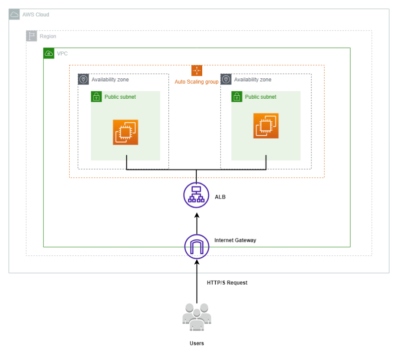

# Application Load Balancer
This module try to do classic simple architecture on AWS to archive high availability and pretty good scalability.

## High Availability
We create Application Load Balancer to do distribute traffics across multiple Availability Zone to avoid AZ failure

## Scalability
We create auto scaling group to scale our application depends on demand.

### Reference Architecture Diagram

###### Special Thanks to
[How to create Application Load Balancer using Terraform](https://antonputra.com/amazon/create-alb-terraform/#create-aws-alb-with-auto-scaling-group)

[Solution Architect Course by Stephane Maarek](https://www.udemy.com/course/aws-certified-solutions-architect-associate-saa-c03/)
